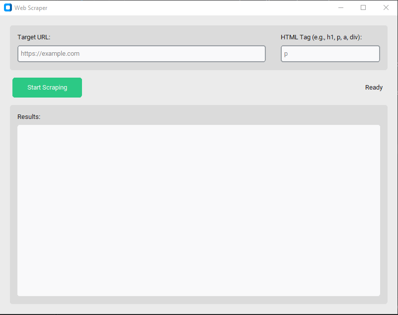
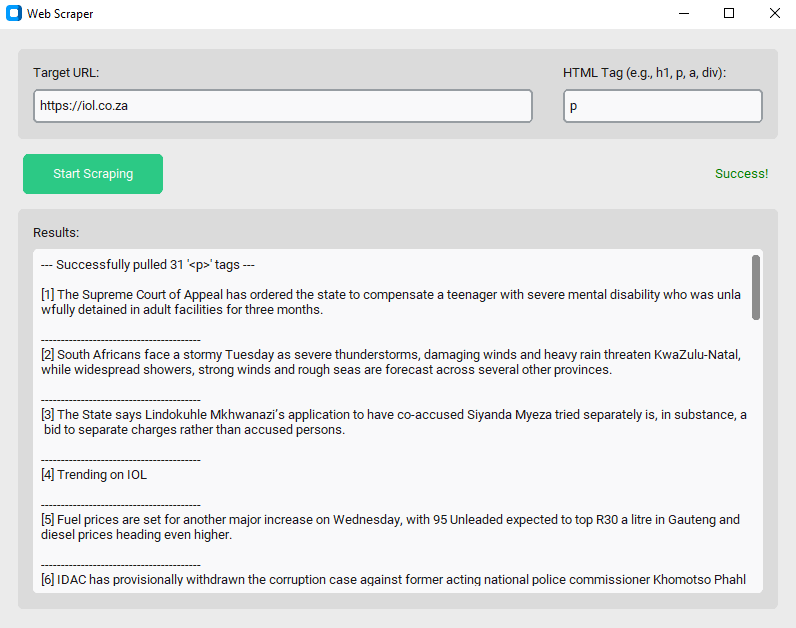
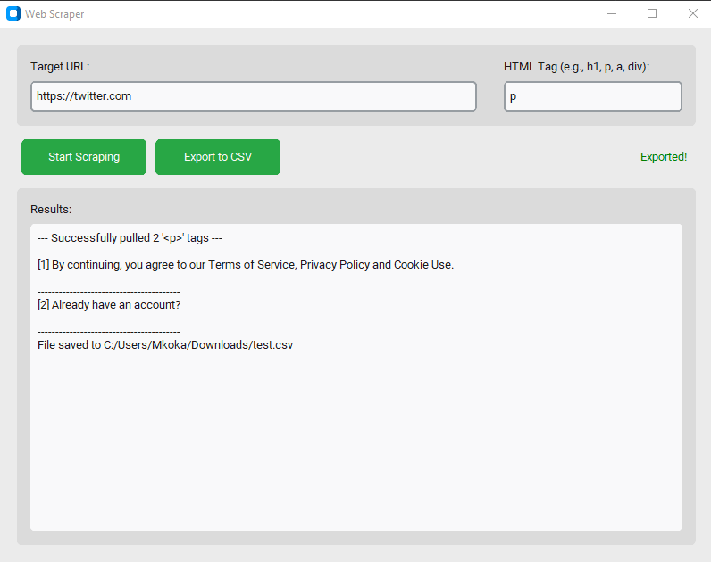

# Web Scraper

A simple GUI application for scraping HTML tags from a specified URL
using:
- Python
- CustomTkinter
- Requests
- BeautifulSoup

---

## Features
- ** Modern Visual Design:** Leverages `CustomTkinter` widgets providing automatic dark/light adaptive system scaling, responsive grid spacing layouts, and sharp iconography components.
- ** Asynchronous Multithreading:** Delegates intensive HTTP requests directly to dedicated background execution pools to prevent native window thread locks or UI freezing.
- ** Built-in Network Resiliency:** Safe exception tracking blocks mitigate network disconnect drops, server timeouts, and raw `4xx / 5xx` HTTP failures gracefully.
- ** Dual-Format Data Export:** Includes a context-aware dataset exporter allowing you to natively save raw results into a clean `.txt` document file block layout or a highly structured `.csv` spreadsheet database.

---

## Setup

### Prerequisites
- Python 3.8 or newer

### Running the Application
Download or clone the code locally, navigate into the directory containing `app.py`, open the terminal environment (Terminal or Command Prompt) in the project folder, then run:

```bash
pip install -r requirements.txt
```   

```bash
python app.py
```






---

## Application Architecture & Workflow

The architecture is explicitly broken down across three structured layers to maintain scalability:

1. **Input Parameters Window (`ctk.CTkEntry` Layout):**
   Validates the user's target address structure securely using native url filters (`urllib.parse`) while setting an automatic fallback parameters framework targeting the standard paragraph structure if queries are left empty.
2. **The Worker Operations Thread (`threading.Thread` Node):**
   Spawns a clean client simulation (`User-Agent` spoofing header matrix) to confidently fetch remote assets using the standard library toolsets while updating user status alerts in a thread-safe workflow.
3. **The Data Assembly Matrix (`BeautifulSoup` Engine):**
   Locates the explicit target tags requested, separates raw values away from structural text markup arrays, visually appends elements into a clean code frame, and triggers execution routes inside the data exporter modules.
